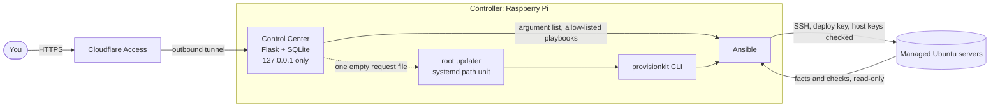
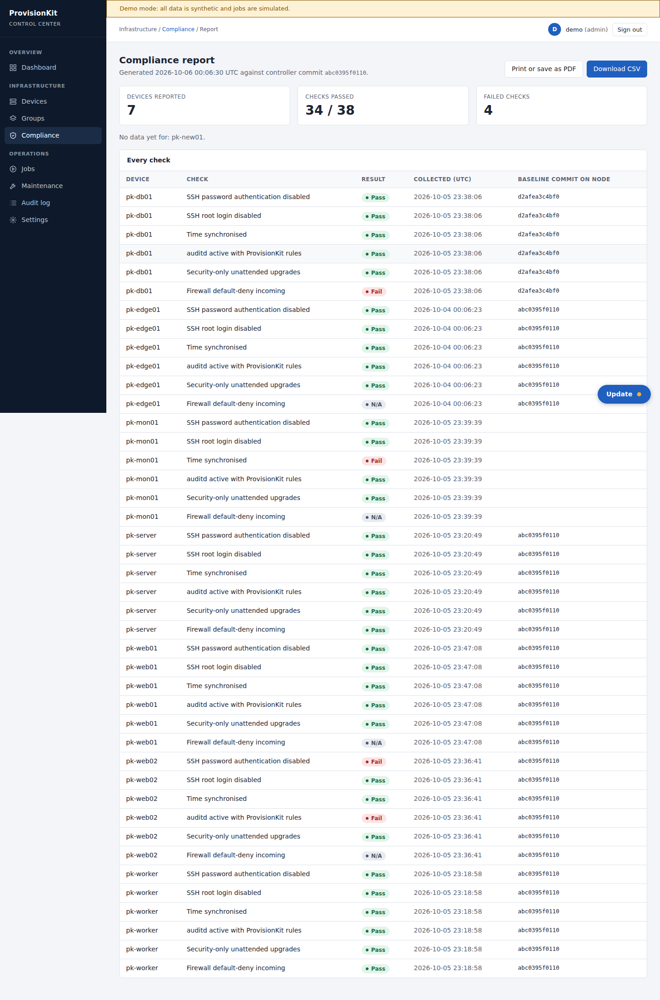
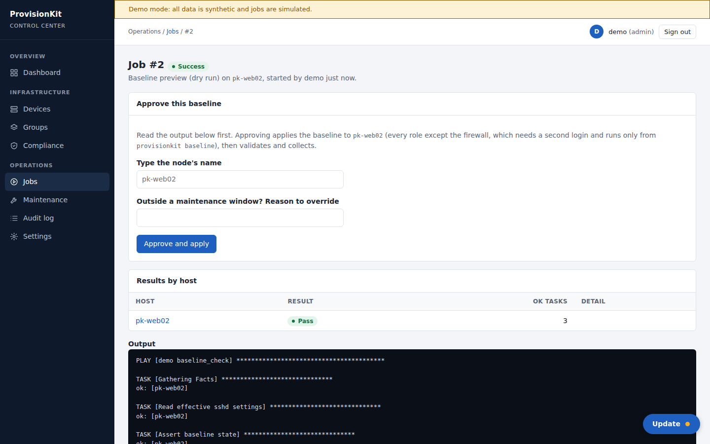
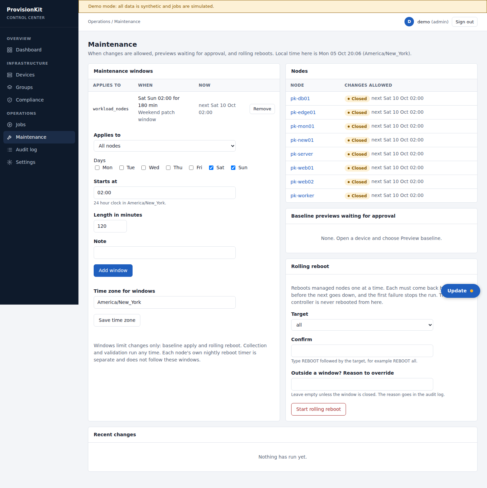
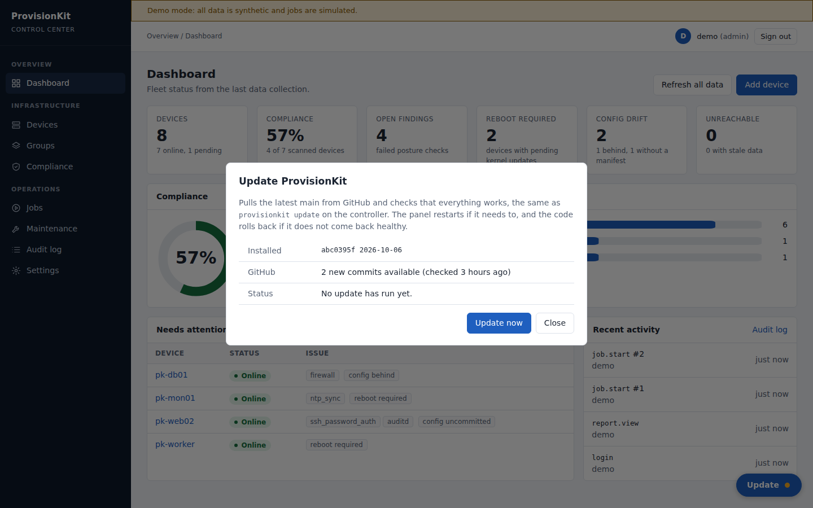

# ProvisionKit

[](https://github.com/Flintstqne/provisionkit/actions/workflows/ci.yml)

Ansible provisioning, hardening and fleet management for a small Linux lab, with a web console and a command line that
run on a Raspberry Pi controller. It brings new Ubuntu servers to a documented security baseline, proves they stay
there, and lets you change them from a browser with approval, maintenance windows and an audit trail.

Built as a systems engineering and security project. The design decisions, the threat model and the limits are
written down, because they are the interesting part.


*Screenshots use the panel's built-in demo mode, which shows synthetic data. Run it yourself in one command (below).*

## Try it

```
git clone https://github.com/Flintstqne/provisionkit.git && cd provisionkit
bash scripts/demo.sh          # http://127.0.0.1:8080, sign in as demo / demo-password-123
```

Needs Python 3.11 or newer. No sudo, no servers, no Ansible runs: jobs are simulated.

## Install on a controller

```
curl -fsSLO https://raw.githubusercontent.com/Flintstqne/provisionkit/main/scripts/install.sh
less install.sh               # read it first
bash install.sh               # as your normal user; it uses sudo where needed
```

It installs missing packages (with your confirmation), clones the repository, builds the Python environment, creates the
deploy key and a ready-to-use inventory for this machine, creates the first admin with a generated password, and
starts the panel as a hardened systemd service. Running it again changes nothing that already exists.
Options and the manual route are in [docs/install.md](docs/install.md). From then on, `provisionkit update` keeps it current.

## How it fits together



- The panel listens on loopback only. A Cloudflare tunnel and Access policy are the only way in, and the panel verifies the
  Access token itself.
- The panel runs unprivileged. The one root action it can trigger (the Update button) goes through a request file and a
  systemd path unit, and root writes only to a directory the panel cannot write.
- Ansible is the only thing that touches servers. Collection is read-only. Changes need an approved preview.

## What it does

**Hardening baseline** (Ansible roles, applied one node at a time with a dry run first):
key-only SSH with a timed rollback, no root login, UFW default-deny with a timed rollback, security-only unattended
upgrades, persistent size-capped journal, auditd rules for identity, sudo, SSH and managed paths, time sync, admin
accounts, a nightly reboot timer, and a manifest that records which git commit configured each node.
`playbooks/validate.yml` checks all of it read-only.

**Control Center** (`panel/`):

| | |
|---|---|
|  |  |
| Searchable fleet list with status and compliance | Per-device hardware, network, storage, checks, drift and activity |
|  |  |
| Posture matrix across the fleet | Printable report and CSV with commit and collection time |
|  |  |
| Baseline preview, then typed approval | Maintenance windows, rolling reboot |
|  |  |
| Guided setup for a new server | Update button runs `provisionkit update` |

Also: scheduled collection, config drift (Current, Behind, Uncommitted, No manifest), host key review before first
contact, role-based access (viewer, operator, admin), an audit log, encrypted backup and restore, and a JSON API.

**Command line** (`scripts/provisionkit`, standard library only): `update` (pulls `main`, repairs the environment, restarts the
panel, rolls back if it does not come back healthy), `check`, `baseline NODE`, `nightly-reboot`, `backup`, `restore`, `status`.
See [docs/cli.md](docs/cli.md).

## Security design

Written up in [SECURITY.md](SECURITY.md) and [docs/threat-model.md](docs/threat-model.md): assets, trust boundaries, each
threat with its control and the test that covers it, and the risks that remain (for example: the deploy key on the
controller opens every node, and a bad commit on `main` would run as root through `provisionkit update`).
Highlights: strict CSP with no inline script, CSRF tokens on every write, scrypt password hashes with lockout, a sandboxed
service unit (`NoNewPrivileges`, read-only home, short write list), argument-list subprocesses only, and every state change
audited.

## Testing

354 pytest cases across 18 files, plus yamllint, ansible-lint and `ansible-playbook --syntax-check` on every playbook,
all run by `make check` and by [CI](.github/workflows/ci.yml) on every push. Dependencies are pinned in
`requirements-ci.txt` and kept current by Dependabot.

| Area | Tests | What they exercise |
|---|---|---|
| Panel core | [test_panel.py](tests/test_panel.py), [test_panel_proxy.py](tests/test_panel_proxy.py) | auth, roles, CSRF, lockout, inventory edits that keep comments, job runner, Cloudflare token and header handling |
| Setup and scheduling | [test_setup.py](tests/test_setup.py), [test_scheduler.py](tests/test_scheduler.py) | host key trust against a real throwaway sshd, guided checklist, collection timer |
| Drift and baseline | [test_drift.py](tests/test_drift.py), [test_baseline.py](tests/test_baseline.py) | real git repositories, relevance filter, dry run, confirmation and validation flow |
| Updates | [test_update_cli.py](tests/test_update_cli.py), [test_update_panel.py](tests/test_update_panel.py), [test_cli.py](tests/test_cli.py) | fast-forward only, rollback, status files the panel reads as untrusted text |
| Nightly reboot | [test_nightly_reboot.py](tests/test_nightly_reboot.py), [test_nightly_cli.py](tests/test_nightly_cli.py), [test_nightly_panel.py](tests/test_nightly_panel.py) | script with stubbed commands, real Ansible template rendering, systemd calendar parsing |
| Operations | [test_operations.py](tests/test_operations.py) | maintenance windows (midnight, daylight saving), approval rules, rolling reboot gating, report |
| Backup | [test_backup.py](tests/test_backup.py), [test_backup_cli.py](tests/test_backup_cli.py) | round trip, tampering, wrong passphrase, hostile archive entries, keys left out |
| Install | [test_install.py](tests/test_install.py) | the real installer in a fresh home directory, run twice |
| UI | `scripts/screenshots.py` (headless Chromium, not in CI) | drives the demo through every page above and the Update dialog |

```
make check        # everything above
make panel-demo   # the demo
```

## Status, honestly

Verified on real hardware (Raspberry Pi 4 controller, one Ubuntu 24.04 server): bootstrap, base system, users, SSH hardening
(both rollback paths), automatic updates, logging, audit rules, validation, collection through the panel, the panel service
behind a Cloudflare tunnel with Access, `provisionkit update`, and the time zone change.

Written and tested without hardware, so **not yet run on real machines**: the firewall role, the full baseline apply from the
panel, rolling reboot, the systemd path unit behind the Update button (the sandbox this was built in has no systemd), and the
local LLM server role. Details and the reasons are in the threat model and the individual docs.

Not built: Fail2Ban, sysctl profiles, Docker, monitoring, K3s, a second managed node, two-factor sign-in, metrics history.
Ideas and priorities: [docs/panel-roadmap.md](docs/panel-roadmap.md).

## Repository map

```
panel/            Flask app: fleet, jobs, drift, windows, approvals, backup, updater
roles/            Ansible roles (baseline, nightly_reboot, baseline_manifest, llm_server)
playbooks/        bootstrap, baseline, validate, collect, reboot_rolling, preflight
scripts/          install.sh, demo.sh, install_panel.sh, provisionkit (CLI), validate_inventory.py
inventories/      example (documentation addresses); local is git-ignored and holds your real data
tests/            pytest suite
docs/             install, operations, CLI, baseline, threat model, tunnel, nightly reboot, LLM server
```

Real addresses, keys and Vault files go in `inventories/local/` (git-ignored).

## Docs

[Install](docs/install.md) · [Operations](docs/operations.md) · [CLI](docs/cli.md) · [Baseline](docs/baseline.md) ·
[Cloudflare tunnel](docs/cloudflare-tunnel.md) · [Panel update](docs/panel-update.md) · [Nightly reboot](docs/nightly-reboot.md) ·
[Threat model](docs/threat-model.md) · [Panel roadmap](docs/panel-roadmap.md) · [Local LLM server](docs/llm-server.md)
