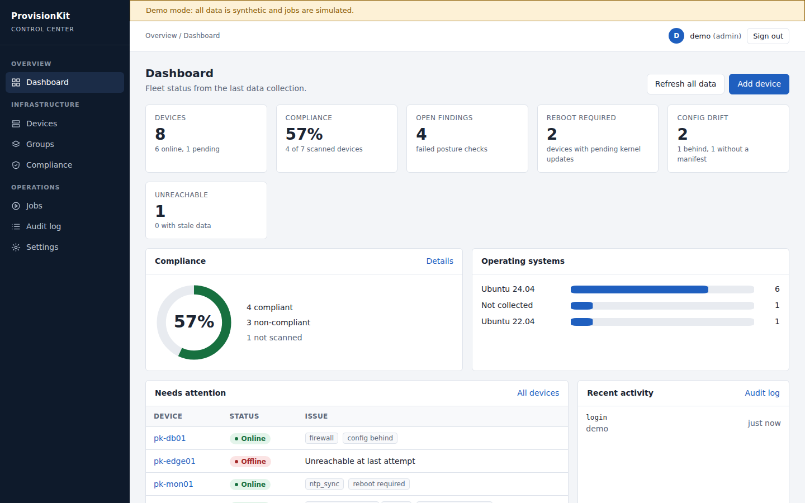
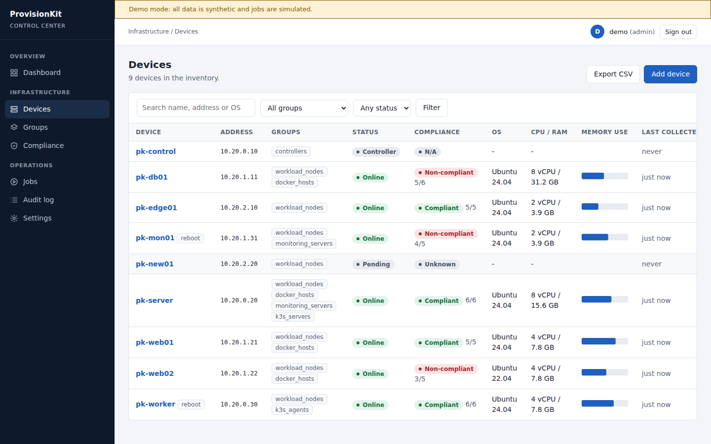
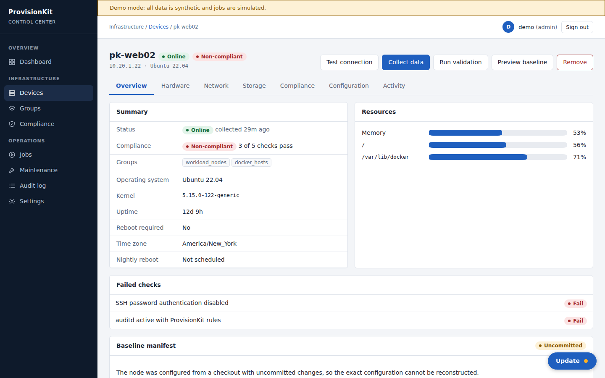
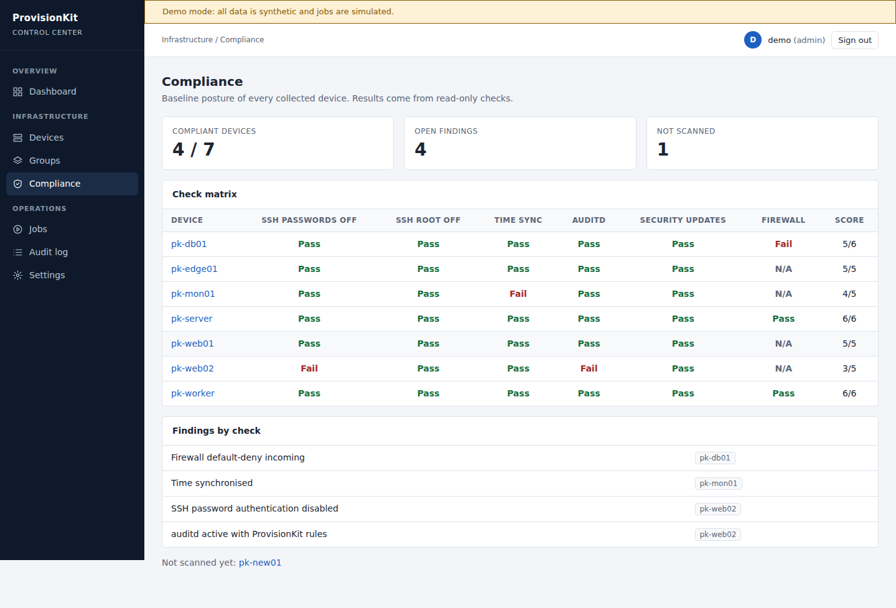
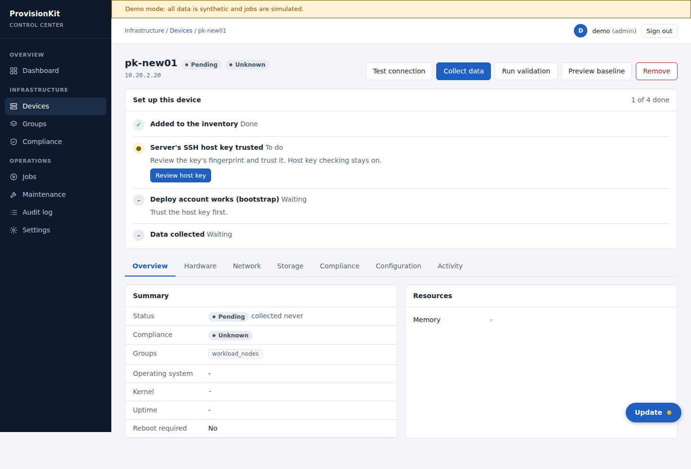
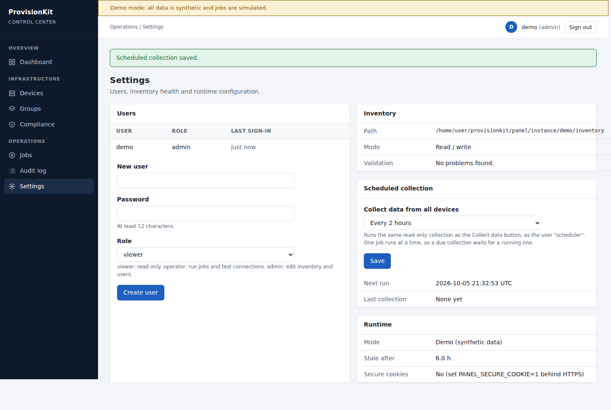

# ProvisionKit Control Center

A small web console for the ProvisionKit controller. It reads the Ansible inventory, collects facts and baseline
posture from every managed server, and shows fleet status, compliance and job history. It runs on the controller (a
Raspberry Pi is enough): Flask, SQLite and server-rendered HTML. No Node, no build step, no external assets.

| Dashboard | Devices |
|---|---|
|  |  |
|  |  |
|  |  |

## What it does

- **Dashboard**: device counts, compliance score, open findings, pending reboots, OS mix, devices needing attention.
- **Devices**: searchable, sortable list with status and compliance. Per-device tabs for overview, hardware, network,
  storage, compliance checks, configuration (inventory entry and `group_vars`, secrets masked) and activity.
- **Guided setup for new devices**: after you add a device, its page shows a checklist. The admin reviews the
  server's SSH host key fingerprint and trusts it with one click (the panel re-reads the key and refuses if the
  fingerprint changed since the review), then data collection starts. The one manual step is bootstrapping the
  deploy account, which needs the server's initial admin login. The panel never handles that login, so the checklist
  shows the exact command to copy.
- **Scheduled collection**: Settings has a timer (every 30 minutes up to daily, or off). It runs the same read-only
  collect job as a user named `scheduler`, one job at a time. Data counts as stale after three missed runs.
- **Add and remove devices**: writes the Ansible inventory (`inventories/local/hosts.yml`). Comments are kept, the
  change is validated by `scripts/validate_inventory.py` before it is saved, and the previous file is backed up
  to `.backups/`. Adding a device never connects to it.
- **Compliance**: matrix of posture checks per device (SSH password login, root login, time sync, auditd rules,
  security-only updates, firewall).
- **Jobs**: run `collect`, `validate` or `preflight` against all hosts, a group or one host. Live output, per-host
  results, one job at a time (the controller is small).
- **Audit log**: sign-ins, inventory changes, jobs. Roles: viewer, operator, admin.
- **JSON API**: `GET /api/v1/devices`, `GET /api/v1/summary`, `GET /healthz`.

## How data gets in

`playbooks/collect.yml` gathers facts and runs read-only checks on each target (it changes nothing there). It writes
one JSON file per host on the controller. The panel ingests those files into SQLite and parses the play recap to
record which hosts were unreachable. The panel can only start the three allow-listed playbooks above. It cannot run
`baseline`, `bootstrap` or any playbook that changes a server.

## Run it

```
python3 -m venv .venv && . .venv/bin/activate
pip install -r panel/requirements.txt ansible-core"<2.20"

python -m panel init-inventory          # once: copies inventories/example to inventories/local (git-ignored)
python -m panel create-user alice --role admin
python -m panel run                     # http://127.0.0.1:8080
```

### Install as a service on the controller

On pk-control, as the account that already runs Ansible (it holds the deploy key and the servers' host keys):

```
git clone <your repo url> ~/provisionkit && cd ~/provisionkit
sudo scripts/install_panel.sh            # asks for an admin username and password
```

The script builds the virtualenv, creates `inventories/local` if missing, adds the admin user, installs and starts
`provisionkit-panel.service` (loopback only), and waits for the health check. It is safe to run again. Then, from your
own computer: `ssh -L 8080:127.0.0.1:8080 <user>@<controller>` and open `http://127.0.0.1:8080`. Settings for HTTPS or
a Cloudflare tunnel go in `/etc/provisionkit-panel.env` (commented template created for you).
`scripts/install_panel.sh --print-unit` shows the systemd unit without installing anything.

Try it without a lab: `python -m panel demo` serves synthetic data on loopback (sign in as `demo` /
`demo-password-123`) and simulates jobs.

Without `inventories/local` the panel uses the example inventory read-only. Replace the documentation addresses and
keys in `inventories/local` before collecting from real servers. New devices need `bootstrap.yml` run from the
command line first, and their SSH host key in the controller's `known_hosts` (`ansible.cfg` keeps host key checking on).

## Security notes

- Binds to loopback by default. For access from other machines use TLS in front, for example
  `deploy/nginx.conf.example`, and set `PANEL_SECURE_COOKIE=1`. `scripts/install_panel.sh` installs a hardened unit.
- Remote access through a Cloudflare tunnel with Access token verification: see [../docs/cloudflare-tunnel.md](../docs/cloudflare-tunnel.md).
- Password hashes (scrypt), 12 character minimum, per-user and per-IP lockout, CSRF tokens on every POST, session
  reset on sign-in, strict Content-Security-Policy (no inline script or style), no secrets shown in the UI.
- Job targets are checked against the inventory and passed to Ansible as an argument list, never through a shell.
- Whoever can sign in as admin can edit the inventory, and operators can make the controller run read-only playbooks
  against your servers. Treat the panel account like SSH access to the controller.
- The service runs as the controller account that holds the deploy key, because the panel starts `ansible-playbook` as that
  user. A dedicated account is tighter but needs the key's permissions and `known_hosts` set up for it.

## Status

Tested: 68 pytest cases (auth, roles, CSRF, lockout, inventory editing and validation, job runner, fleet states,
log parsing, setup checklist, host key trust, scheduler). The host key tests run against a real throwaway sshd and are
skipped where none is installed. The whole flow (collect fails on an untrusted key, trust it in the panel, collect
succeeds, device goes Online) was also run once over real SSH and real Ansible against a local sshd. `collect.yml` was run end to end through the panel's job runner against localhost with real
`ansible-core` 2.19. **Not tested** against real remote servers, over SSH, or on the Raspberry Pi. The unreachable-host
path is covered only by a parser test on sample output. There is no TLS, password reset or per-user history beyond the
audit log. Facts are a point-in-time snapshot; there is no metrics history.

```
make check        # includes the panel tests
make panel-demo
```
